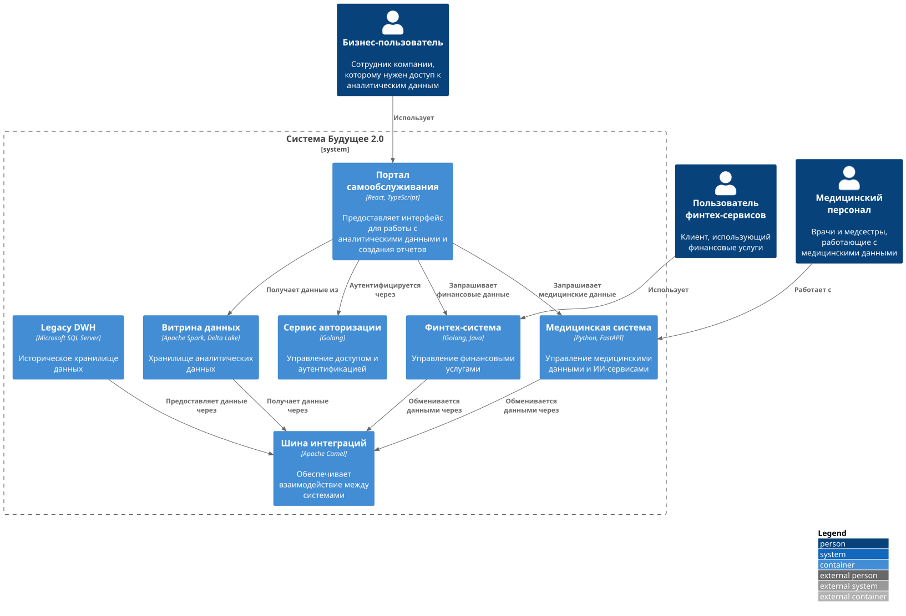

# Задание 1. 

## 1. Архитектура системы TO BE ()

### Диаграмма контейнеров

## 2. Описание проблем и рекомендации
| Категория | Проблемное место | Риски | Рекомендации |
|-----------|------------------|--------|--------------|
| Производительность | Витрина данных на Apache Spark | - Высокая нагрузка при сложных запросах - Длительное время обработки больших объемов данных | - Внедрить кэширование часто запрашиваемых данных - Использовать предварительную агрегацию данных - Рассмотреть использование ClickHouse для аналитических запросов |
| Безопасность | Централизованная авторизация | - Единая точка отказа - Сложность управления правами для разных доменов | - Внедрить многофакторную аутентификацию - Реализовать распределенную систему авторизации - Внедрить аудит доступа к данным |
| Интеграция | Шина интеграций Apache Camel | - Сложность поддержки большого количества интеграций - Потенциальные узкие места при передаче данных | - Внедрить мониторинг производительности шины - Использовать асинхронные паттерны - Рассмотреть использование Apache Kafka для потоковой обработки |
| Данные | Legacy DWH | - Сложность синхронизации с новыми системами - Риск потери данных при миграции - Высокие затраты на поддержку | - Разработать пошаговый план миграции - Внедрить механизмы верификации данных - Создать резервные копии критических данных |
| Масштабируемость | Медицинская система | - Сложность масштабирования ИИ-сервисов - Высокие требования к ресурсам | - Внедрить контейнеризацию (Docker, Kubernetes) - Реализовать горизонтальное масштабирование - Оптимизировать работу с медицинскими данными |
| Надежность | Портал самообслуживания | - Зависимость от всех остальных систем - Сложность отказоустойчивости | - Внедрить кэширование на уровне портала - Реализовать graceful degradation - Использовать CDN для статического контента |
| Мониторинг | Распределенная система | - Сложность отслеживания проблем - Отсутствие единой картины состояния | - Внедрить централизованный мониторинг (Prometheus, Grafana) - Настроить алертинг - Внедрить трейсинг (Jaeger, Zipkin) |
| Стоимость | Общая инфраструктура | - Высокие затраты на поддержку legacy-систем - Стоимость лицензий и инфраструктуры | - Оптимизировать использование ресурсов - Рассмотреть облачные решения - Внедрить автоматическое масштабирование |
| Поддержка | Множество технологий | - Сложность поиска специалистов - Высокие затраты на обучение | - Стандартизировать стек технологий - Создать внутреннюю документацию - Внедрить автоматизацию развертывания |
| Бизнес-процессы | Интеграция новых бизнесов | - Сложность адаптации новых бизнес-процессов - Риск нарушения работы существующих процессов | - Создать четкие правила интеграции - Внедрить механизмы версионирования API - Разработать SLA для всех компонентов |

## 3. Приоритизация задач по методу MoSCoW
### Must have (Критически важные)
#### Безопасность - Централизованная авторизация
- Обоснование: Работа с медицинскими и финансовыми данными требует строгого контроля доступа
- Риски: Утечка данных, несанкционированный доступ
- Влияние на бизнес: Критическое (репутационные и финансовые потери)
#### Данные - Legacy DWH
- Обоснование: Необходимость сохранения и корректной миграции исторических данных
- Риски: Потеря данных, нарушение работы бизнес-процессов
- Влияние на бизнес: Критическое (прерывание работы компании)
#### Надежность - Портал самообслуживания
- Обоснование: Основной интерфейс для работы с данными
- Риски: Простой в работе, потеря доступа к критическим данным
- Влияние на бизнес: Критическое (прерывание бизнес-процессов)
### Should have (Важные)
#### Производительность - Витрина данных
- Обоснование: Влияет на скорость принятия решений
- Риски: Задержки в получении отчетов
- Влияние на бизнес: Значительное (снижение эффективности)
#### Мониторинг - Распределенная система
- Обоснование: Необходимость быстрого реагирования на проблемы
- Риски: Длительное время обнаружения и устранения проблем
- Влияние на бизнес: Значительное (снижение качества сервиса)
#### Интеграция - Шина интеграций
- Обоснование: Критична для работы всех систем
- Риски: Нарушение обмена данными между системами
- Влияние на бизнес: Значительное (нарушение бизнес-процессов)
### Could have (Желательные)
#### Масштабируемость - Медицинская система
- Обоснование: Важно для будущего роста
- Риски: Ограничения при увеличении нагрузки
- Влияние на бизнес: Среднее (влияет на развитие)
#### Поддержка - Множество технологий
- Обоснование: Влияет на эффективность поддержки
- Риски: Высокие затраты на поддержку
- Влияние на бизнес: Среднее (влияет на операционные расходы)
#### Бизнес-процессы - Интеграция новых бизнесов
- Обоснование: Важно для расширения бизнеса
- Риски: Сложности при добавлении новых направлений
- Влияние на бизнес: Среднее (влияет на развитие)
### Won't have (Не приоритетные)
- Стоимость - Общая инфраструктура
- Обоснование: Может быть оптимизирована позже
- Риски: Высокие операционные расходы
- Влияние на бизнес: Низкое (влияет на прибыльность)