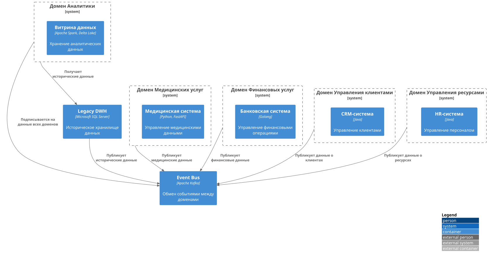

# Задание 2. 

## 1. Домены компании (DDD)

### 1. Домен "Медицинские услуги"
#### Основные компоненты:
- Медицинская информационная система
- ИИ-сервисы для анализа медицинских данных
- Система управления медицинским оборудованием
#### Данные:
- Медицинские карты
- Результаты исследований
- Данные медицинского оборудования
- История лечения
#### Интеграционные точки:
- API для обмена данными с другими доменами
- Шлюз для интеграции с внешними медицинскими системами
### 2. Домен "Финансовые услуги"
#### Основные компоненты:
- Банковская система
- Система управления счетами
- Кредитный портал
- Платежная система
#### Данные:
- Финансовые транзакции
- Кредитные истории
- Счета клиентов
- Платежные данные
#### Интеграционные точки:
- API для финансовых операций
- Шлюз для интеграции с внешними финансовыми системами
### 3. Домен "Аналитика"
#### Основные компоненты:
- Витрина данных
- Система построения отчетов
- Портал самообслуживания
- Система управления метриками
#### Данные:
- Агрегированные бизнес-показатели
- Аналитические дашборды
- Отчеты
- Ключевые метрики
#### Интеграционные точки:
- API для получения агрегированных данных
- Шлюз для интеграции с BI-системами
### 4. Домен "Управление клиентами"
#### Основные компоненты:
- CRM-система
- Система управления лояльностью
- Портал клиента
- Система коммуникаций
#### Данные:
- Профили клиентов
- История взаимодействий
- Предпочтения клиентов
- Данные лояльности
#### Интеграционные точки:
- API для управления клиентскими данными
- Шлюз для интеграции с маркетинговыми системами
### 5. Домен "Управление ресурсами"
#### Основные компоненты:
- Система управления персоналом
- Система управления инвентарем
- Система управления активами
- Система планирования ресурсов
#### Данные:
- Данные о персонале
- Инвентаризация
- Активы компании
- Планы ресурсов
#### Интеграционные точки:
- API для управления ресурсами
- Шлюз для интеграции с ERP-системами

## 2. Диаграмма потока данных (DFD) между доменами

## 3. Обоснование логики разделения на домены
### Домен "Медицинские услуги"
#### Логика выделения:
- Ядро бизнеса компании
- Высокие требования к безопасности и конфиденциальности данных
- Специфические регуляторные требования (медицинская тайна)
#### Преимущества:
- Изоляция медицинских данных
- Независимое развитие медицинских сервисов
- Возможность сертификации по медицинским стандартам
### Домен "Финансовые услуги"
#### Логика выделения:
- Отдельная лицензия на банковскую деятельность
- Специфические требования к финансовым операциям
- Необходимость соответствия финансовым регуляторам
#### Преимущества:
- Изоляция финансовых данных
- Независимое развитие банковских продуктов
- Соответствие финансовым регуляторам
### Домен "Аналитика"
#### Логика выделения:
- Централизованный доступ к данным для анализа
- Необходимость агрегации данных из всех доменов
- Требования к производительности аналитических запросов
#### Преимущества:
- Единая точка для бизнес-аналитики
- Оптимизация производительности аналитических запросов
- Централизованное управление доступом к аналитике
### Домен "Управление клиентами"
#### Логика выделения:
- Единый взгляд на клиента
- Переиспользование клиентских данных
- Централизованное управление клиентским опытом
#### Преимущества:
- Единый профиль клиента
- Кросс-продажи между направлениями
- Улучшение клиентского опыта
### Домен "Управление ресурсами"
#### Логика выделения:
- Общие ресурсы для всех направлений
- Централизованное управление затратами
- Оптимизация использования ресурсов
#### Преимущества:
- Эффективное управление ресурсами
- Снижение операционных затрат
- Улучшение планирования