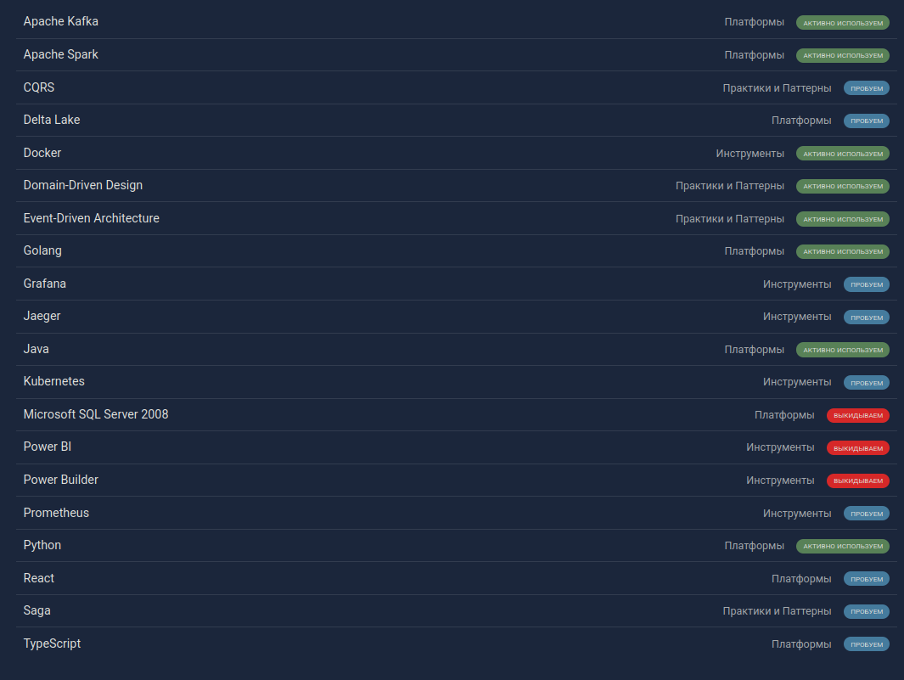
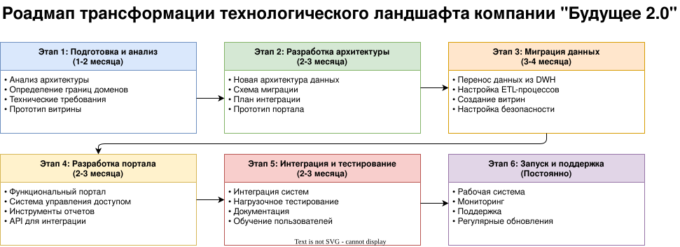

# Задание 3. 

## 1. Технически радар

Запустить интерактивный радар можно следуя инструкции:

```
cd Task3/techRadar
npm run build
npm run serve
```

Ниже сводная таблица технологий:



## 2. Roadmap трансформации



## 3. Обноснование этапов

### Этап 1: Подготовка и анализ (1-2 месяца)
Этот этап критически важен, так как:
- Анализ текущей архитектуры позволяет понять все существующие проблемы и узкие места
- Определение границ доменов помогает правильно разделить ответственность между разными частями системы
- Технические требования формируют четкое понимание того, что нужно построить
- Прототип витрины данных позволяет быстро проверить концепцию и получить обратную связь от бизнеса

### Этап 2: Разработка архитектуры (2-3 месяца)
Необходим для:
- Создания новой архитектуры данных, которая решит проблемы масштабируемости и производительности
- Разработки схемы миграции, которая минимизирует риски при переходе на новую систему
- Планирования интеграции новых бизнесов (фармацевтические компании и производитель электроники)
- Создания прототипа портала для валидации технических решений

### Этап 3: Миграция данных (3-4 месяца)
Ключевой этап, на котором:
- Обеспечивается безопасный перенос данных из старого DWH
- Настраивается ETL-процессы для обеспечения качества данных
- Создается витрины данных для быстрого доступа к аналитике
- Внедряется систему безопасности для защиты конфиденциальных данных

### Этап 4: Разработка портала (2-3 месяца)
Фокусируется на:
- Создании удобного портала самообслуживания для бизнес-пользователей
- Внедрении системы управления доступом для контроля доступа к данным
- Разработке инструментов для создания отчетов
- Создании API для интеграции с другими системами

### Этап 5: Интеграция и тестирование (2-3 месяца)
Обеспечивает:
- Корректную интеграцию всех компонентов системы
- Проверку производительности под нагрузкой
- Создание документации для пользователей и разработчиков
- Обучение пользователей работе с новой системой

### Этап 6: Запуск и поддержка (Постоянно)
Необходим для:
- Обеспечения стабильной работы системы
- Мониторинга производительности и выявления проблем
- Поддержки пользователей
- Регулярного обновления и улучшения системы
